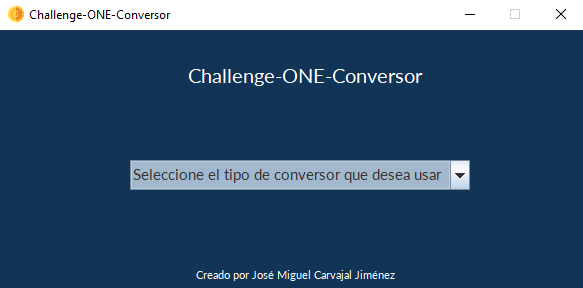
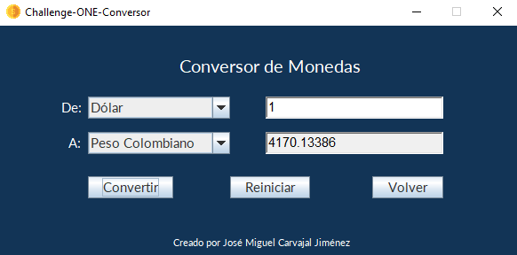
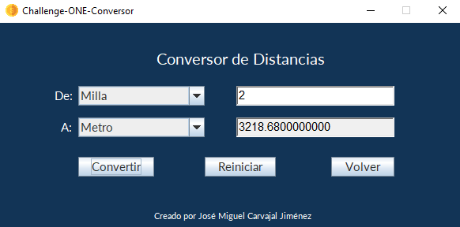

 

# Challenge-ONE-Conversor

 

 

 

 

## Descripción

Este proyecto hace parte del segundo challenge del curso de Oracle Next Education. 

Consiste en la creación de un conversor de divisas utilizando el lenguaje Java. Las características solicitadas por nuestro cliente son las siguientes:

Requisitos:

El convertidor de moneda debe:

        - Convertir de la moneda de tu país a Dólar
        - Convertir de la moneda de tu país a Euros
        - Convertir de la moneda de tu país a Libras Esterlinas
        - Convertir de la moneda de tu país a Yen Japonés
        - Convertir de la moneda de tu país a Won sul-coreano

Recordando que también debe ser posible convertir inversamente, es decir:

        - Convertir de Dólar a la moneda de tu país
        - Convertir de Euros a la moneda de tu país
        - Convertir de Libras Esterlinas a la moneda de tu país
        - Convertir de Yen Japonés a la moneda de tu país
        - Convertir de Won sul-coreano a la moneda de tu país
Extras:
Como desafío extra implementé la capacidad de realizar la conversion entre cualquiera de las divisas mencionadas. Y ademas de esto agregue 2 conversores extra. El primero siendo un conversor de temperaturas, y el segundo es un conversor de distancias.